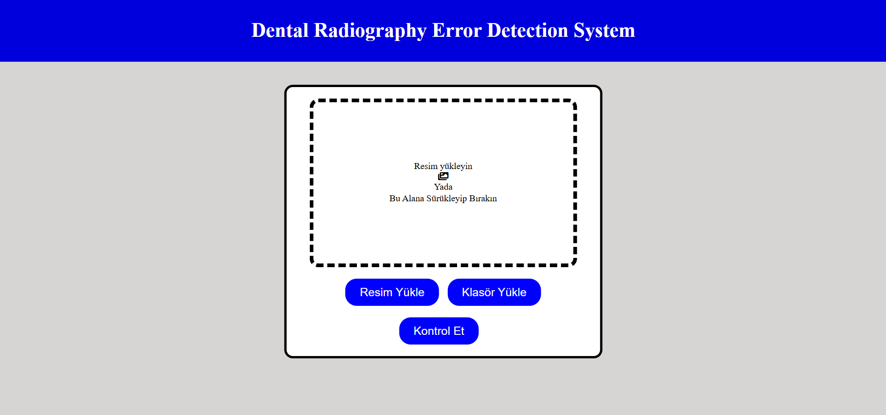

# Computer Project-1

## Project Description
This project explores an automated system for detecting errors in panoramic dental X-ray images using deep learning. Vision Transformer models, including DeiT and BEiT, were evaluated with different hyperparameters such as optimizers and learning rates

## UI

  
  
  

## Models Link:
https://drive.google.com/drive/u/0/folders/1v5IgT-qA0gwJlw6QTrglR8YSvxDOSJ08
