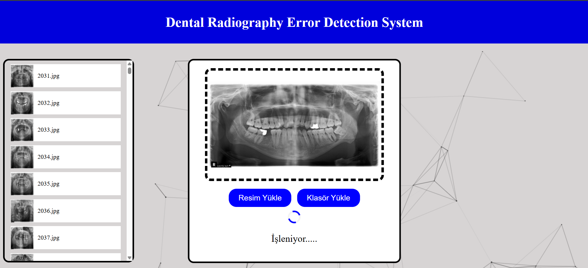
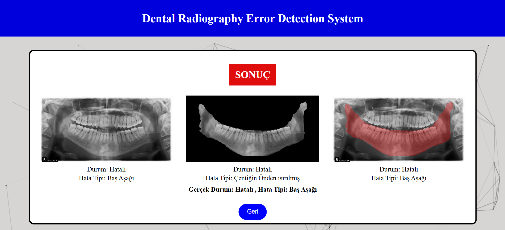

# Computer Project-1

## Project Description
This project explores an automated system for detecting errors in panoramic dental X-ray images using deep learning.

### Training Process
In this project, it was built two models to classify images according to error existence. First model was trained on entire dental X-Ray image and the second one was trained on mandibular images. These models was trained with K-Fold cross validation technique. The prediction results of these tow models was combined for each classification task to test model performance with this method as well. This methodology was independently applied to both DeiT and BEiT Vision Transformer models.
Both DeiT and BEiT models were evaluated with different hyperparameters such as optimizers and learning rates.

## App Screenshots

  
  
  

## Models Link:
https://drive.google.com/drive/u/0/folders/1v5IgT-qA0gwJlw6QTrglR8YSvxDOSJ08
